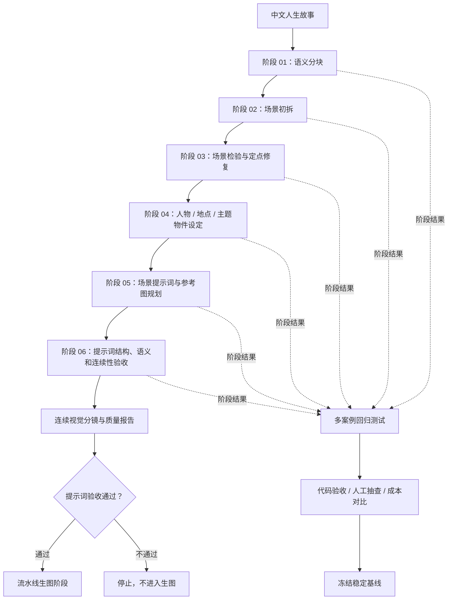

# AI 叙事视觉化流水线与回归测试体系

> 将中文人生故事转化为结构化场景、连续视觉分镜和可执行的生图任务，通过代码校验、阶段检查点和参考图规划保障文本与生图链路质量，并在流水线代码变更后使用多案例回归验证稳定性。

## 项目概览

这是一个面向 AI 内容生产的工程化流水线。输入一篇中文人生故事，文本流水线先完成语义分块、场景拆分、人物/地点/主题物件设定、场景提示词生成、参考图规划和最终验收；验收通过后，结构化结果可以直接交给生图流水线，继续执行角色参考图和场景图生成。

项目重点不是单次调用模型，而是解决长流程 AI 应用中的几个实际问题：

- 模型输出不稳定，容易缺号、重复、漏掉原文或改变人物关系；
- 多阶段任务很长，失败后如果从头重跑，会重复消耗时间和模型费用；
- 场景之间需要保持人物外貌、地点空间和主题物件连续；
- “请求成功”不代表结果质量合格，需要可追溯的自动验收和人工抽查；
- 测试方案的质量、Token、缓存、耗时和费用需要能够横向比较。

## 在线演示

[打开“人生副本”在线工作台](https://fuben.mkang.asia)

在线工作台展示完整六阶段案例、阶段结果和导入已生成案例功能。当前线上版本用于可视化展示，流水线实际运行在本地 Node.js 环境，不对外提供实时运行接口。

## 项目成果

文本处理和生图执行是一条上下游链路，回归测试则是针对流水线代码改动的独立验证层：

```text
中文人生故事
    ↓
文本流水线
    ↓
结构化提示词 + 参考图计划
    ↓
提示词验收
    ├─ 通过 → 生图流水线 → 角色参考图 → 场景图生成
    └─ 不通过 → 定点修复 / 停止

流水线代码 / Schema / 适配器发生改动
    ↓
多案例回归测试 + 成本分析
```

### 文本流水线

- 建立从中文故事到语义块、连续场景、人物/地点/主题物件设定的六阶段处理流程；
- 通过 JSON Schema、稳定索引、原文哈希和代码验收约束模型输出；
- 支持失败项定点修复、阶段级 checkpoint 和长任务中断恢复；
- 输出可供下游生图任务直接消费的场景级提示词和连续性信息。

### 生图流水线

- 将场景提示词标准化为可调度的生图任务；
- 支持异步任务提交、状态轮询、依赖调度和失败阻塞；
- 根据人物可见性、地点锚点和人生阶段组合多张参考图；当前规则支持最多 3 张，其中人物参考图最多 1 张、场景参考图最多 2 张；
- 复用角色阶段图和场景锚点，减少重复生图并保持人物、地点和画面风格连续；
- 支持缺失任务定点补跑，不重复执行已经完成的图片任务。

文本流水线通过必要验收后，可以使用 `--generate-images` 直接进入生图环节，不需要人工复制和重新整理提示词。

### 回归测试与成本优化

- 当流水线代码、Schema、模型适配器、checkpoint 或跨阶段字段发生修改时，使用 10 篇固定案例对受影响阶段做逐阶段回归；
- 单阶段规则修改运行“问题案例 + 3 篇哨兵案例”，公共规则改动运行受影响阶段的全部 10 篇案例；
- 阶段 05/06 的一次全量回归中，10 篇案例通过结构、语义、参考图和比例验收，覆盖 840 条场景级提示词；
- 阶段 03 采用纯代码检验，阶段测试支持真实 API 适配器和历史响应回放；
- 记录请求数、Token、缓存、耗时和估算费用，用于判断代码改动是否值得冻结，不能因为命令成功就直接更新基线。

## 技术栈

`Node.js` · `DeepSeek API` · `JSON Schema` · `异步任务调度` · `Checkpoint` · `回放测试` · `Token/费用统计` · `Vercel`

## 整体架构



## 六阶段流程

| 阶段 | 主要职责 | 关键控制点 |
| --- | --- | --- |
| 01 语义分块 | 按地点、事件和逻辑层次划分全文 | 数量、顺序、原文覆盖和语义边界 |
| 02 场景初拆 | 将语义块拆成连续原子场景 | 稳定 `unitId`、场景顺序和文字覆盖 |
| 03 场景检验 | 检查场景长度、顺序和连续性 | 纯代码处理可确定问题，减少模型调用 |
| 04 全局设定 | 生成人物、地点和主题物件设定 | 独立任务并行、设定复用和跨块一致性 |
| 05 提示词生成 | 将场景和设定转换为生图提示词 | 人物可见性、场景锚点、阶段参考图 |
| 06 最终验收 | 检查最终提示词和参考图计划 | 结构、语义、阶段、中文、比例和定点修复 |

## 核心工程设计

### 1. 模型生成 + 代码校验 + 定点修复

模型负责语义理解和视觉表达，代码负责确定性规则。每次模型输出都要经过 Schema 和阶段专用验收器；只有被代码定位为失败的场景才进入修复请求，修复后还会再次验收。

这样避免把完整结果重新交给模型重写，降低输出漂移和无关内容被改写的风险。

### 2. 稳定索引与原文哈希

流水线不直接相信模型返回的编号，而是由代码维护稳定索引、预期场景编号和原文 SHA256。恢复或回放时会核对流水线版本、输入哈希、结果路径和结果哈希，避免不同输入或错误运行结果被混用。

### 3. 阶段级 checkpoint 与中断恢复

每个阶段保存输入、规范化结果、验收报告、用量信息和最新 checkpoint。长任务中断后可以从缺失阶段或缺失任务继续，不需要重复调用已经通过的前序阶段。

### 4. 参考图的代码确定性规划

生图阶段不让模型自由决定所有参考图。代码根据人物是否可见、地点锚点是否合格、人生阶段和前序场景关系组合人物参考图与场景参考图；当前 Schema 支持最多 3 张参考图，减少未来场景引用、人物错配和跨阶段外貌漂移。

### 5. 代码改动后的回归测试与成本分析

回归测试不是文本或生图生产链路中的一步，而是代码修改后的质量门。真实 API 适配器用于验证模型行为，回放适配器用于复用历史响应；两者分开后，可以在不产生新模型费用的情况下验证公共校验器、目录结构、恢复逻辑和基线读取逻辑。只有质量、成本和可追溯性都满足要求，才更新稳定基线。

## 代表性测试结果

测试范围为 10 篇固定案例、阶段 01～06。公开版只展示汇总数据，不包含案例原文、完整提示词或原始响应。

| 阶段 | 结果 | 代表性指标 |
| --- | --- | --- |
| 01 语义分块 | 10/10 通过 | 平均质量分 94.1 |
| 02 场景初拆 | 10/10 通过 | 平均质量分 92.1；成本较基线下降 32.2% |
| 03 场景检验 | 10/10 通过 | 0 次模型请求；纯代码方案 |
| 04 全局设定 | 10/10 通过 | 30 次请求；成本较基线下降 21.2% |
| 05 提示词生成 | 10/10 通过 | 840 条提示词；82 次请求；估算费用 1.0882 元 |
| 06 最终验收 | 10/10 通过 | 840 条提示词；最终参考图和比例检查通过 |

阶段 05/06 的一次完整方案对比中，新候选增加了参考图说明任务，但通过缓存复用和结构化处理，将总估算费用从约 1.55 元降到约 1.37 元，下降约 12%。这不是简单压缩提示词，而是通过代码确定性处理和结果复用减少重复工作。

## 公开材料导航

### 文本流水线

负责将中文故事转换为语义块、连续场景、人物/地点/物件设定和场景提示词。

- [模块说明](./text-pipeline/README.md)
- [开发者指南](./text-pipeline/developer-guide.md)

### 生图流水线

主展示版本为 Node.js 实现，负责提示词标准化、异步任务轮询、依赖调度、参考图复用和失败恢复。

- [模块说明](./image-pipeline/README.md)
- [开发者指南](./image-pipeline/developer-guide.md)

### 多案例回归测试

负责在流水线代码改动后执行阶段测试、历史回放、失败定位、稳定基线判断和成本比较。

- [模块说明](./regression-testing/README.md)
- [开发者指南](./regression-testing/developer-guide.md)
- [测试报告](./regression-testing/testing-report.md)
- [成本分析](./regression-testing/cost-analysis.md)

## 公开范围与边界

本仓库是公开技术展示材料，不是完整源码仓库。公开内容包括项目介绍、架构图、开发者指南、脱敏测试报告、成本分析和在线工作台链接。

以下内容保留在私有环境：

- 完整流水线源码和模型适配器实现；
- DeepSeek、图像模型等 API Key；
- 完整提示词、原始模型响应和运行日志；
- 含个人信息的案例原文和完整 checkpoint；
- 未经授权的图片、参考图和第三方素材。

## 当前限制

- 线上工作台目前展示已有案例，不提供公开实时运行流水线；
- 测试质量分是项目内部评估指标，不等同于最终用户满意度；
- 生图结果仍受外部模型、平台接口和提示词解释影响；
- 费用是根据运行时 Token 和价格快照估算，不等同于最终账单。
