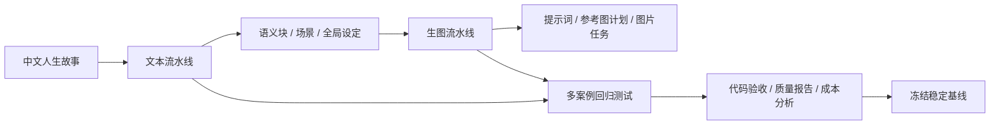

# AI 叙事视觉化流水线与回归测试体系

一套将中文人生故事转换为连续视觉分镜的 AI 工程系统，覆盖文本结构化、生图提示词生成、参考图规划和多案例回归测试。

> 核心流水线源码暂不公开。本仓库只展示架构、开发者文档、脱敏结果和测试证据。

## 在线工作台

[人生副本 · Vercel 工作台](https://fuben.mkang.asia)

线上工作台用于展示六阶段案例和阶段结果；流水线实际运行仍在本地 Node.js 环境完成。

## 项目组成

| 模块 | 作用 | 技术重点 |
| --- | --- | --- |
| [文本流水线](./text-pipeline/) | 故事 → 语义块、场景、人物/地点/物件设定 | Node.js、DeepSeek API、JSON Schema、checkpoint |
| [生图流水线](./image-pipeline/) | 场景提示词 → 参考图规划和连续生图任务 | Node.js、异步任务、依赖调度、参考图复用 |
| [回归测试](./regression-testing/) | 对阶段 01～06 做多案例验证和成本比较 | 稳定基线、回放测试、失败定位、Token/费用统计 |

## 整体架构

## 可展示的工程能力

- 以稳定索引、原文哈希和 Schema 校验约束模型输出；
- 通过阶段级 checkpoint 支持中断恢复，避免长任务重复调用；
- 将可确定的编号、覆盖、参考图选择和格式检查交给代码；
- 支持模型生成、代码验收、定点修复和最终复查；
- 通过回放适配器复用历史响应，减少回归测试成本；
- 记录请求数、Token、缓存、耗时和估算费用，用数据决定是否冻结改动。

## 公开范围

公开内容包括项目介绍、架构图、开发者指南、脱敏运行结果、Vercel 工作台和测试报告摘要。完整源码、API Key、完整提示词、原始响应、案例原文和运行日志保留在私有环境中。

## 文档

- [文本流水线开发者指南](./text-pipeline/developer-guide.md)
- [生图流水线开发者指南](./image-pipeline/developer-guide.md)
- [回归测试开发者指南](./regression-testing/developer-guide.md)
- [测试报告](./regression-testing/testing-report.md)
- [成本分析](./regression-testing/cost-analysis.md)
