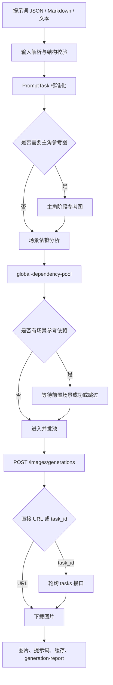

# 人生叙事 Maizi 批量生图器开发者指南

> 面向 `life-narrative-maizi-images.js` 的开发、调试与集成说明。

## 一句话概述

`life-narrative-maizi-images.js` 是一个 Node.js 命令行生图调度器：它读取人生叙事流水线生成的场景提示词和参考图规划，调用 Maizi 图片生成 API，按依赖关系生成主角阶段参考图与场景图，并保存图片、缓存、日志和生成报告。

源码入口：[`life-narrative-maizi-images.js`](<private-image-repository>/life-narrative-maizi-images.js)

## 背景与解决的问题

直接循环调用图片 API 生成多张场景图，通常会遇到以下问题：

- 场景提示词来自不同格式，解析方式不统一；
- 需要先生成主角参考图，再生成依赖该参考图的场景；
- 某个场景引用了前面场景的图片时，不能提前并发提交；
- 已生成图片再次运行时可能重复提交并产生费用；
- API 可能同步返回图片 URL，也可能返回异步任务 ID；
- 网络错误、任务失败和依赖未满足需要区分处理；
- 生图完成后缺少提示词、参考图、URL、文件和费用信息，难以复盘。

本脚本采用“结构化任务解析 + 全局依赖池调度 + 本地结果复用 + Maizi 异步任务轮询”的方式解决这些问题。它只负责生图执行，不负责生成上游人生叙事提示词。

## 整体架构



## 模块划分

| 模块 | 主要职责 | 关键函数 |
| --- | --- | --- |
| CLI 参数 | 解析模型、尺寸、并发、筛选和运行模式 | `parseArgs()`、`showHelp()` |
| 输入解析 | 查找输入文件，解析 JSON/Markdown/纯文本任务 | `resolveInput()`、`parsePrompts()`、`parseJsonPromptItems()` |
| 参考图规划 | 规范化人物/场景参考图，建立主角阶段链 | `normalizeReferencePlan()`、`buildCharacterReferencePlan()` |
| 任务校验 | 检查编号、文字块和场景参考依赖 | `validateAndSortPrompts()`、`findMissingIndices()` |
| Maizi API | 提交生图任务、解析 URL、轮询异步任务 | `runMaizi()`、`pollMaiziTask()` |
| 本地文件 | 上传本地参考图、下载结果、判断图片是否可用 | `uploadLocalImageToMaizi()`、`downloadImage()`、`isUsableImage()` |
| 调度器 | 根据场景依赖动态释放并发任务 | `sceneDependencies()`、`runDependencyScheduler()` |
| 报告与缓存 | 保存结果、远程 URL、上传缓存和总结报告 | `writeReport()`、`writeGenerationSummary()` |

## 输入格式

### JSON 输入

脚本支持以下 JSON 结构：

- 顶层数组：`[{ ... }]`；
- 顶层 `prompts` 数组：`{ "prompts": [{ ... }] }`；
- V2 常用结构：`{ "prompts": { "items": [{ ... }] } }`；
- 顶层 `items` 数组：`{ "items": [{ ... }] }`。

单个任务的核心字段如下：

```json
{
  "index": 1,
  "blockIndex": 1,
  "stageId": "childhood",
  "originalText": "原文对应的场景文字",
  "prompt": "完整独立生图提示词",
  "referenceInstruction": "参考图片使用说明",
  "referencePlan": {
    "references": [
      {
        "sourceType": "character",
        "characterId": "protagonist",
        "characterRefId": "stage-childhood",
        "referenceRole": "保持主角身份连续"
      },
      {
        "sourceType": "scene",
        "sceneIndex": 1,
        "referenceRole": "延续前一场景构图"
      }
    ]
  }
}
```

`referencePlan.references` 最多保留 3 张参考图；其中人物参考图最多 1 张，场景参考图最多 2 张。场景参考必须指向同一文字块中、编号更早的场景，否则输入校验会失败。

### Markdown 与纯文本输入

目录输入会依次查找：

```text
prompts.json
工作流结果.json
04-提示词.txt
提示词.txt
提示词.md
prompts.txt
```

Markdown 和纯文本适合兼容人工整理的提示词，但无法提供完整的 `referencePlan` 时，脚本只能按无参考图任务处理。需要人物或场景连续性时，优先使用包含结构化字段的 JSON。

## 核心流程

### 1. 任务解析与排序

`parsePrompts(content)` 依次尝试 JSON、Markdown 和简单文本格式，并交给 `validateAndSortPrompts()` 标准化。脚本会按场景编号排序，同时检查：

- `index` 是否为正整数；
- 是否存在重复编号；
- 场景参考是否指向更早场景；
- 场景参考是否位于同一文字块；
- 使用参考图时 `referenceInstruction` 是否存在；
- 不使用参考图时是否错误填写 `referenceInstruction`。

### 2. 主角阶段参考图

当输入包含 `characterBible.protagonist`，或通过 `--character-only` 明确要求生成角色参考图时，脚本会读取：

- `protagonist`：稳定身份和外貌；
- `timelineStages`：人生阶段和视觉基调；
- `stageCostumes`：阶段服装与状态；
- `characterReferencePlan.items`：阶段参考图 ID 与 `referenceFrom` 链。

阶段参考图按顺序生成。第一阶段通常通过文字锁定身份，后续阶段引用前一阶段图片，但只继承脸型、肤色、发型等身份信息，不继承前一阶段的年龄、身高、服装和道具。已有本地文件或远程 URL 会被标记为 `skipped`，避免重复生成。当前主流程不会自动单独生成 `identity_master.png`；若需要固定身份母版，应通过 `--protagonist-ref` 提供本地图片或 URL。

### 3. 场景依赖调度

`sceneDependencies(task)` 从 `referencePlan.references` 中提取 `sourceType: "scene"` 的场景编号。`runDependencyScheduler()` 使用全局依赖池：

- 没有场景依赖的任务立即进入并发池；
- 所有场景依赖成功或被跳过后，当前任务才会释放；
- 依赖失败时，当前任务标记为 `blocked`；
- 被阻塞场景的下游依赖会继续递归阻塞；
- 调度始终按编号优先选择已就绪任务，但不牺牲依赖约束。

主角阶段参考图不是场景调度器中的场景依赖，而是在场景生成前先完成并写入 `context.stageRefs`。代码中仍导出了 `buildIdentityMasterPrompt()` 和 `identityMasterPath()`，但它们目前不是主流程的实际调用路径。

### 4. 调用 Maizi API

`runMaizi(prompt, options, refImage)` 向 `${MAIZI_BASE_URL}/images/generations` 发送 JSON 请求：

```json
{
  "model": "gpt-image-2",
  "prompt": "完整生图提示词",
  "size": "16:9",
  "n": 1,
  "image": "https://.../reference.png"
}
```

没有参考图时不填写 `image`；有一张参考图时 `image` 为字符串；有多张参考图时 `image` 为数组。Maizi 返回图片 URL 时直接继续下载；若只返回 `task_id`，脚本会轮询 `/tasks/{taskId}`，直到完成、失败或超过默认 5 分钟等待时间。

### 5. 下载与落盘

`downloadImage()` 会下载 API 返回的图片 URL，并检查文件大小。默认最小可用图片大小为 10 KB；下载失败最多重试 3 次。场景文件名包含场景编号和原文前缀，例如：

```text
images/scene_001-今天要体验的人生副本是...png
```

## 核心函数说明

### `parsePrompts(content)`

解析并校验提示词内容。

| 项目 | 说明 |
| --- | --- |
| 参数 | `content: string`，JSON、Markdown 或纯文本 |
| 返回值 | 按 `index` 排序的标准化任务数组 |
| 副作用 | 无文件写入；输入非法时抛出错误 |

### `buildCharacterReferencePlan(characterBible, prompts, options)`

从 V2 角色设定中提取需要生成的主角阶段参考图。

| 项目 | 说明 |
| --- | --- |
| 参数 | `characterBible: object`、`prompts: PromptTask[]`、`options.allStages` |
| 返回值 | `{ available, globalStyle, protagonist, stages }` |
| 副作用 | 无；只建立计划，不调用 API |

### `runMaizi(prompt, options, refImage, runtime)`

提交一次 Maizi 生图任务并返回图片 URL。

| 项目 | 说明 |
| --- | --- |
| `prompt` | 最终发送的完整生图提示词 |
| `options` | 至少包含 `model`、`size`；通常来自 CLI 配置 |
| `refImage` | 空值、单个本地/远程图片，或图片数组 |
| `runtime.maizi` | 可注入 API 配置；测试时可注入 `fetchImpl` |
| 返回值 | `{ urls, raw }`，异步任务完成时还包含 `taskId` |
| 副作用 | 调用 Maizi API；可能产生第三方费用 |

### `runDependencyScheduler(tasks, context, recordResult)`

按场景参考依赖运行并发任务。

| 项目 | 说明 |
| --- | --- |
| `tasks` | 标准化场景任务数组 |
| `context` | 输出目录、并发配置、Maizi 运行时和缓存 |
| `recordResult` | 每个任务完成后写入报告的回调 |
| 返回值 | 按场景编号排序的结果数组 |
| 状态 | `success`、`skipped`、`failed`、`blocked` |

### `isUsableImage(filePath)`

判断已有图片是否可复用。文件必须存在、是普通文件且达到最小字节数；可复用时场景会返回 `skipped`，不会再次调用 API。

## 快速开始

### 环境要求

- Node.js 18 或更高版本；
- 可访问 Maizi API 的网络环境；
- UTF-8 编码的提示词文件或 V2 工作流 JSON；
- `MAIZI_API_KEY`，必要时另配 `MAIZI_WEB_TOKEN`；
- 不需要额外 npm 依赖，脚本使用 Node.js 内置模块和全局 `fetch`。

### 配置 API Key

在脚本同目录创建 `.env`，不要提交到 Git：

```dotenv
MAIZI_API_KEY=你的密钥
# 可选：MAIZI_BASE_URL=https://www.maizitech.xyz/v1
# 可选：MAIZI_WEB_TOKEN=用于官方上传接口的令牌
# 可选：MAIZI_TASK_MAX_WAIT_SECONDS=300
# 可选：MAIZI_POLL_INTERVAL_MS=5000
```

脚本也会读取环境变量；`OPENAI_API_KEY` 可作为兼容回退，但建议明确使用 `MAIZI_API_KEY`。

### 先执行免费 dry-run

```powershell
node <private-image-repository>\life-narrative-maizi-images.js `
  <private-image-repository>\案例1\prompts.json `
  --foreground `
  --dry-run
```

dry-run 会解析任务、显示第一批可并行场景和参考图关系，不调用 Maizi，不产生生图费用。

### 前台生成场景图

```powershell
node <private-image-repository>\life-narrative-maizi-images.js `
  <private-image-repository>\案例1\prompts.json `
  --foreground `
  --model gpt-image-2 `
  --size 16:9 `
  --character-size 16:9 `
  --concurrency 5 `
  --retries 1
```

### 只生成主角参考图

```powershell
node <private-image-repository>\life-narrative-maizi-images.js `
  <private-image-repository>\案例1\工作流结果.json `
  --foreground `
  --character-only `
  --character-size 16:9
```

### 只生成部分场景

```powershell
# 生成第 1、3、6 到 9 场景
node <private-image-repository>\life-narrative-maizi-images.js `
  <private-image-repository>\案例1\prompts.json `
  --foreground `
  --only-scenes 1,3,6-9
```

如果选中的场景引用了未选中的前置场景，脚本会直接拒绝该范围；需要把依赖场景一并加入筛选范围。

## CLI 参数速查

| 参数 | 默认值 | 作用 |
| --- | --- | --- |
| `<输入>` | 必填 | 提示词文件或包含候选文件的目录 |
| `--model` | `gpt-image-2` | Maizi 生图模型 |
| `--size` | `16:9` | 场景图尺寸或比例 |
| `--character-size` | `16:9` | 主角母版和阶段参考图尺寸 |
| `--concurrency` | `10` | 全局并发数，范围 1–10 |
| `--retries` | `1` | 任务失败后的重新提交次数，范围 0–10 |
| `--protagonist-ref` | 空 | 主角身份母版的本地路径或 URL |
| `--character-only` | 关闭 | 只生成主角阶段参考图 |
| `--only-block` | 全部 | 只生成指定文字块，可重复使用 |
| `--only-scenes` | 全部 | 只生成指定场景编号或编号范围 |
| `--foreground` | 否 | 当前终端前台运行 |
| `--background` | 否 | 隐藏后台运行，日志写入输出目录 |
| `--print-prompts` | 关闭 | 打印完整发送提示词，可能暴露原文 |
| `--print-agent-results` | 关闭 | 打印 Maizi 返回的图片 URL |
| `--dry-run` | 关闭 | 只解析检查，不调用 API |

## 输出目录与报告

默认输出目录是输入文件同级的 `images`：

```text
images/
├─ character_refs/
│  └─ stage_<阶段ID>.png
├─ scene_001-<原文前缀>.png
├─ maizi-prompts/
│  ├─ <任务名>.prompt.txt
│  └─ <任务名>.result.json
├─ generation-report.json
├─ generation-summary.md
├─ upload-cache.json
├─ remote-url-cache.json
├─ maizi-run.log
└─ maizi-run.err.log
```

`generation-report.json` 保存模型、尺寸、并发、筛选范围、第一批可并行场景、主角参考图结果、每个场景结果和汇总状态。`generation-summary.md` 进一步按场景图和主角参考图统计文件大小、耗时、成功情况和费用；如果 API 返回 `cost` 字段，优先使用真实费用，否则按脚本内置价格表估算。

## 状态与失败处理

| 状态 | 含义 | 后续处理 |
| --- | --- | --- |
| `success` | 图片生成并成功下载 | 下游依赖可以继续 |
| `skipped` | 本地图片或远程 URL 可复用 | 下游依赖可以继续，不重复扣费 |
| `failed` | 当前 API、下载或任务执行失败 | 按 `--retries` 重试；最终失败后下游阻塞 |
| `blocked` | 前置场景失败或被阻塞 | 不调用 API，保留阻塞原因 |

重试适合处理明确失败，但不能把已有可用图片强制重新生成。若需要重新生成，应该明确删除对应输出，或使用上层流程提供的覆盖策略；当前脚本的核心默认行为是复用已有结果。

## 测试与可注入接口

脚本通过 `module.exports` 暴露解析、校验、调度、API 和文件处理函数，便于单元测试。API 相关函数支持在 `runtime` 中注入 `fetchImpl`，生图与下载流程也支持注入实现：

```js
const {
  parsePrompts,
  sceneDependencies,
  runDependencyScheduler,
  runMaizi,
} = require('<private-image-repository>/life-narrative-maizi-images.js')

const tasks = parsePrompts(jsonText)
console.log(tasks.length, sceneDependencies(tasks[0]))
```

测试时建议覆盖：

- JSON、Markdown 和纯文本三种输入；
- 重复编号、缺失编号和非法参考场景；
- 主角阶段 `referenceFrom` 链；
- 无依赖场景的并发执行；
- 前置场景失败后的递归 `blocked`；
- Maizi 直接返回 URL 和返回 `task_id` 两种响应；
- 本地图片复用、远程 URL 缓存和上传缓存；
- API 失败、下载失败和任务轮询超时。

基础语法检查：

```powershell
node --check <private-image-repository>\life-narrative-maizi-images.js
```

## 注意事项

### 费用与幂等性

`--dry-run` 不产生 API 请求；正式运行会调用 Maizi 并产生第三方费用。脚本会复用可用图片、阶段参考图和远程 URL 缓存，避免重复生图。不要为了“刷新结果”随意删除 `images` 目录。

### 参考图上传

本地参考图会通过 Maizi 官方上传接口转换为远程 URL，并使用 `upload-cache.json` 缓存。若上传凭证无效，脚本会报错，不会自动回退到第三方临时图床。

### 并发与依赖

并发范围为 1–10。并发越高，吞吐量越高，但也会增加 API 压力和同时失败的数量。依赖场景不会因为并发设置而提前执行；只有前置场景成功或跳过后才会进入队列。

### 安全与文件提交

不要提交以下内容：

- `.env`、API Key 和 Web Token；
- `images/` 下的完整生成结果和原始响应；
- `maizi-prompts/` 中包含完整故事和提示词的日志；
- `generation-report.json` 中的远程 URL、费用和运行信息。

### 兼容性

脚本使用 Node.js 全局 `fetch`、`AbortController` 相关现代运行能力，建议 Node.js 18+。Maizi 接口返回字段如果变化，需要同步检查 `extractUrlsFromMaiziPayload()`、`extractTaskId()` 和 `pollMaiziTask()`。

## 版本与维护信息

- 当前脚本注释版本：V2 工作流配套 Maizi 批量生图；
- 报告格式版本：`generation-report.json` 使用 `version: 4`；
- 默认模型：`gpt-image-2`；
- 默认接口：`https://www.maizitech.xyz/v1`；
- 当前定位：本地 Node.js CLI/批处理工具，不是线上实时生图后端；
- 维护重点：输入 Schema 兼容、参考图依赖正确性、Maizi 异步任务响应兼容、缓存和费用统计准确性。

## 相关文件

- 源码：[`life-narrative-maizi-images.js`](<private-image-repository>/life-narrative-maizi-images.js)
- 上游流水线指南：[`life-narrative-pipeline-developer-guide.md`](<public-documents>/life-narrative-pipeline-developer-guide.md)


