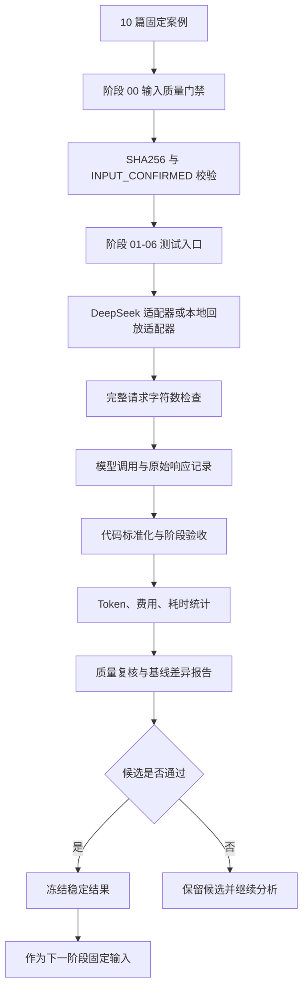

# AI 叙事流水线多案例回归测试与成本分析开发者指南

> 面向 `private-pipeline-repository` 阶段测试工具和 `sanitized-cases-root` 固定案例目录的开发、运行与结果复核说明。

## 一句话概述

这是一套为人生叙事 AI 流水线搭建的多案例逐阶段回归测试体系：使用 10 篇固定案例，对阶段 01～06 的代码修改进行可重复测试，记录输入哈希、模型响应、代码验收、Token、费用、耗时和测试结果，支持基线比较、失败定位和稳定结果冻结。

## 项目边界

本项目由两部分组成：

- `private-pipeline-repository`：保存核心流水线、阶段测试入口、模型适配器、回放工具和自动化测试；
- `sanitized-cases-root`：保存固定案例原文、输入质量状态、测试结果、稳定基线和对比报告。

测试代码和测试数据分离，避免把大量原文、模型日志和生成结果混入代码仓库，也避免复制出两份容易漂移的测试实现。

## 背景与解决的问题

AI 流水线不能只通过“命令执行成功”或顶层 `passed: true` 判断质量。一次修改可能出现：

- 原文遗漏、重复、倒序或被模型改写；
- 场景边界、人物连续性或参考关系退化；
- Schema 通过但业务字段缺失；
- 新增模型调用导致费用和耗时增加；
- 某一个案例通过，却在其他题材中引入回归；
- 阶段输入发生变化，却错误复用了旧阶段结果；
- 单次完整请求超过模型上下文限制。

本系统通过固定案例、阶段级基线、SHA256 输入确认、确定性代码校验和人工质量复核，把流水线修改变成可比较、可追溯、可回退的实验流程。

## 整体架构



## 代码结构

### 核心流水线

- [life-narrative-general-purpose-pipeline.js](<private-pipeline-repository>/life-narrative-general-purpose-pipeline.js)：被测的完整人生叙事流水线。

### 阶段测试执行

- [life-narrative-stage-test.js](<private-pipeline-repository>/life-narrative-stage-test.js)：阶段 01～06 的统一批量测试入口。
- [life-narrative-stage06-test.js](<private-pipeline-repository>/life-narrative-stage06-test.js)：阶段 06 的提示词最终验收专用逻辑。
- [compare-stage06-runs.js](<private-pipeline-repository>/compare-stage06-runs.js)：阶段 06 运行结果对比工具。

### 模型适配器

- [stage-test-deepseek-adapter.js](<private-pipeline-repository>/stage-test-deepseek-adapter.js)：真实 DeepSeek API 适配器，读取模型返回的 usage 并估算费用。
- [stage-test-replay-adapter.js](<private-pipeline-repository>/stage-test-replay-adapter.js)：从已保存的 `raw-response.json` 或 `agent-prompts` 回放，不产生新的模型费用。

### 自动化测试

- [tests](<private-pipeline-repository>/tests)：覆盖阶段 CLI、场景单元、参考图规划、适配器和阶段规则的 Node.js 测试。

## 阶段职责

| 阶段 | 主要职责 | 测试重点 |
| --- | --- | --- |
| 00 | 输入质量门禁 | 编码、标点、段落、事实冲突、SHA256、人工确认状态 |
| 01 | 语义分块 | 原文覆盖、顺序、块数量、地点和事件边界 |
| 02 | 场景初拆 | 原子句段、`unitIds` 连续性、场景覆盖和边界 |
| 03 | 场景检验与修复 | 长度、顺序、覆盖、时间逻辑和定点修复 |
| 04 | 人物/地点/主题物件设定 | 三类设定的完整性、引用关系和并行调用 |
| 05 | 场景提示词生成 | 人物连续性、地点/物件引用、构图和可生图性 |
| 06 | 提示词最终验收 | 结构、语义、中文、比例、参考图和失败项修复 |

## 核心执行流程

### 1. 输入质量门禁

`inspectConfirmedInput()` 会读取 `sanitized-cases-root/输入质量状态.json`，检查：

- 总体状态是否为 `INPUT_CONFIRMED`；
- 当前案例是否存在并且已人工确认；
- 当前正文 SHA256 是否与确认记录一致；
- 确认记录中的正文路径是否仍然匹配。

任何一项不满足时，当前案例会进入 `INPUT_REVIEW_REQUIRED`，测试入口不会继续调用业务模型。

### 2. 创建不可覆盖的运行目录

`createRunDirectory()` 根据案例、阶段和 `runId` 创建独立目录，并拒绝覆盖已有运行结果。`runId` 只允许中文、英文字母、数字、点、横线和下划线，避免路径越界和历史结果被覆盖。

### 3. 构造完整请求并阻断超长 prompt

`buildCompleteRequestPrompt()` 将系统规则、业务提示词、结构化输出要求和 Schema 组合成真正发送给模型的完整请求。代码使用 Unicode 字符数统计：

- 小于 38,000：正常发送；
- 38,000～39,999：进入高风险范围；
- 达到或超过 40,000：在模型调用前阻断。

字符数限制不等于 Token 统计。Token、缓存和费用以适配器返回的 API usage 为准。

### 4. 执行阶段并记录结果

阶段测试入口根据 `--stage` 选择对应的 `runStage*Case()`：

- 阶段 01～05 使用外部适配器；
- 阶段 06 使用 `life-narrative-stage06-test.js` 的专用实现；
- 每个案例单独执行，并按 `--concurrency` 控制案例级并发；
- 每个案例完成后写入结果和 usage；
- 批次结束后生成阶段汇总 JSON 和 `测试运行索引.jsonl`。

### 5. 基线、候选和稳定冻结

测试流程不是“运行成功就覆盖旧结果”，而是：

```text
锁定旧版代码和固定输入
    ↓
建立阶段基线
    ↓
只修改一组同类问题
    ↓
使用相同输入复测
    ↓
比较质量、费用、Token、耗时和请求数
    ↓
通过后冻结，否则保留候选并拒绝替换
```

阶段 02 及之后应从 `测试汇总/当前稳定基线.json` 读取已经冻结的前序结果，不得假定旧式固定路径，也不得在前序结果未冻结时伪造输入。

## 关键接口

### `parseArguments(argv)`

解析统一 CLI 参数，并进行基础范围校验。

| 参数 | 类型 | 说明 |
| --- | --- | --- |
| `--stage` | `01`～`06` | 要执行的阶段 |
| `--cases-root` | 路径 | `sanitized-cases-root` 根目录 |
| `--cases` | 逗号分隔数字 | 案例编号，例如 `1,2,3,4` |
| `--output-root` | 路径 | 测试结果或测试汇总根目录 |
| `--run-id` | 字符串 | 本轮唯一运行 ID |
| `--stage5-run-id` | 字符串 | 阶段 06 使用的阶段 05 运行 ID |
| `--adapter-script` | 路径 | 阶段 01～05 使用的适配器 |
| `--concurrency` | 1～10 | 案例级并发数 |

### `inspectConfirmedInput(casesRoot, caseNumber, sourcePath)`

检查固定案例是否可以进入模型阶段。

返回值包含：

```js
{
  caseNumber: 1,
  status: 'INPUT_CONFIRMED',
  passed: true,
  actualSha256: '...',
  confirmedSha256: '...',
  issues: []
}
```

### `buildCompleteRequestPrompt(prompt, schema)`

构造完整模型请求文本。调用前应使用 `countCharacters()` 检查字符数，不能只统计业务 prompt 而忽略系统指令和 Schema。

### 测试适配器接口

阶段测试入口向适配器传入类似参数：

```js
{
  label,
  prompt,
  schema,
  runDir,
  attempt,
  caseNumber,
  blockIndex,
  taskKind
}
```

适配器可以直接返回业务 JSON，也可以返回带 usage 的包装对象：

```js
{
  result: { /* 阶段业务结果 */ },
  usage: {
    httpRequests: 1,
    promptTokens: 1000,
    completionTokens: 500,
    reasoningTokens: 0,
    cacheHitTokens: 0,
    cacheMissTokens: 1000,
    estimatedCostCny: 0.01,
    model: 'deepseek-v4-flash'
  }
}
```

如果适配器不返回 usage，测试工具会明确记录 usage 不完整，而不是把缺失数据伪装成真实的零成本。

## 运行目录结构

单个案例的阶段运行目录示例：

```text
sanitized-cases-root/
└─ 案例1/
   ├─ 高考省状元的一生.txt
   └─ 测试结果/
      └─ 阶段01-语义分块/
         └─ 20260806-baseline-001/
            ├─ run-meta.json
            ├─ input-quality-report.json
            ├─ input.json
            ├─ prompt.txt
            ├─ prompt-stats.json
            ├─ raw-response.json
            ├─ normalized-result.json
            ├─ code-validation.json
            ├─ quality-review.md
            ├─ usage.json
            ├─ timing.json
            ├─ diff-from-baseline.md
            ├─ checkpoints/
            └─ agent-prompts/
```

批次汇总位于：

```text
sanitized-cases-root/测试汇总/
├─ 当前稳定基线.json
├─ 测试运行索引.jsonl
└─ 阶段01-20260806-baseline-001-summary.json
```

不得使用同一个 `runId` 覆盖旧运行目录，也不得把模型密钥写入 prompt、原始响应或日志。

## 快速开始

### 前置条件

- Node.js 18 或更高版本；
- `private-pipeline-repository` 和 `sanitized-cases-root` 路径可访问；
- 案例正文已经在 `输入质量状态.json` 中标记为 `INPUT_CONFIRMED`；
- 阶段 01～05 使用 DeepSeek 时配置 `DEEPSEEK_API_KEY`；
- 使用回放适配器时，源运行目录中必须存在 `raw-response.json` 或可用的 `agent-prompts` 结果。

### 先运行自动化测试

```powershell
Set-Location <private-pipeline-repository>
node --test tests\deepseek-stage-adapter.test.js tests\stage-test-cli.test.js
```

### 阶段 01 使用回放适配器

```powershell
node <private-pipeline-repository>\life-narrative-stage-test.js `
  --stage 01 `
  --cases-root <sanitized-cases-root> `
  --cases 1,2,3,4 `
  --output-root <sanitized-cases-root> `
  --run-id 20260806-replay-001 `
  --adapter-script <private-pipeline-repository>\stage-test-replay-adapter.js `
  --concurrency 2
```

### 阶段 01 使用 DeepSeek 适配器

```powershell
node <private-pipeline-repository>\life-narrative-stage-test.js `
  --stage 01 `
  --cases-root <sanitized-cases-root> `
  --cases 1,2,3,4,5,6,7,8,9,10 `
  --output-root <sanitized-cases-root> `
  --run-id 20260806-deepseek-001 `
  --adapter-script <private-pipeline-repository>\stage-test-deepseek-adapter.js `
  --concurrency 5
```

该命令会真实调用 DeepSeek，并产生第三方 API 费用。正式运行前应先使用回放或固定 mock 完成工具验证。

### 阶段 02 使用冻结的阶段 01 结果

```powershell
node <private-pipeline-repository>\life-narrative-stage-test.js `
  --stage 02 `
  --cases-root <sanitized-cases-root> `
  --cases 1,2,3,4 `
  --output-root <sanitized-cases-root> `
  --run-id 20260806-stage02-001 `
  --adapter-script <private-pipeline-repository>\stage-test-replay-adapter.js `
  --concurrency 2
```

执行前必须确认 `当前稳定基线.json` 已冻结阶段 01，并且案例原文 SHA256 与冻结记录一致。

## 成本与质量指标

### 成本指标

- HTTP 请求次数；
- 输入、输出和思考 Token；
- 缓存命中与未命中 Token；
- 重试次数；
- 按适配器价格配置计算的估算人民币费用。

### 速度指标

- 单案例总耗时；
- 批次墙钟耗时；
- 模型响应耗时；
- 代码处理耗时；
- 实际案例并发数。

### 质量指标

- 原文完整性和顺序；
- Schema 与字段合法性；
- 场景编号和引用关系；
- 人物、地点、物件连续性；
- 提示词的原文忠实度和可生图性；
- 失败结果是否正确阻断，而不是伪装成功。

硬性正确性必须全部通过。费用或耗时下降不能以原文遗漏、人物漂移或提示词质量退化为代价。

## 注意事项

### 不要把计划指标当成实际结果

“费用下降 30%”“耗时缩短 25%”属于测试目标。只有完成基线和候选运行、保存对比报告后，才能写入真实结果。

### 不要把回放结果当成真实 API 结果

回放适配器的 usage 为零，适合验证解析、合并和验收逻辑，不代表真实模型调用没有成本。

### 不要跳过输入质量确认

如果案例正文 SHA256 变化，之前的阶段结果不能直接继续使用。必须重新确认输入，必要时从阶段 01 重建基线。

### 不要覆盖历史运行

运行目录和汇总文件都使用唯一 `runId`。发现 `RUN_ALREADY_EXISTS` 时，应更换新的运行 ID，不要删除或覆盖旧结果。

### 不要只检查顶层通过字段

必须同时阅读阶段专用字段、缺号/重复号、引用关系、质量复核和 usage。结构化 JSON 合法不等于业务质量合格。

## 维护与扩展

新增阶段规则时：

1. 先修改核心流水线或对应阶段逻辑；
2. 同步更新阶段测试入口和相关适配器；
3. 为新规则添加自动化测试；
4. 使用问题案例和固定哨兵案例做快速回归；
5. 影响公共 Schema、适配器、usage、checkpoint 或跨阶段字段时，运行受影响阶段的全部 10 篇案例；
6. 生成基线与候选对比报告后，才决定是否冻结。

不应为了兼容旧结果，伪造冻结文件、移动案例结果或复制另一份核心测试代码。

## 版本与维护信息

- 当前代码仓库：`<private-pipeline-repository>`；
- 当前测试数据与运行结果目录：`<sanitized-cases-root>`；
- 支持阶段：01～06；
- 默认单批案例并发范围：1～10；
- 单次模型完整请求硬上限：40,000 Unicode 字符；
- 真实模型调用适配器：DeepSeek；
- 本地无费用验证适配器：Saved Response Replay；
- 当前定位：本地回归测试与成本分析工具链，不是线上测试服务。

## 相关文件

- [多案例逐阶段测试计划.md](<sanitized-cases-root>/%E5%A4%9A%E6%A1%88%E4%BE%8B%E9%80%90%E9%98%B6%E6%AE%B5%E6%B5%8B%E8%AF%95%E8%AE%A1%E5%88%92.md)
- [life-narrative-stage-test.js](<private-pipeline-repository>/life-narrative-stage-test.js)
- [life-narrative-pipeline-developer-guide.md](<public-documents>/life-narrative-pipeline-developer-guide.md)


