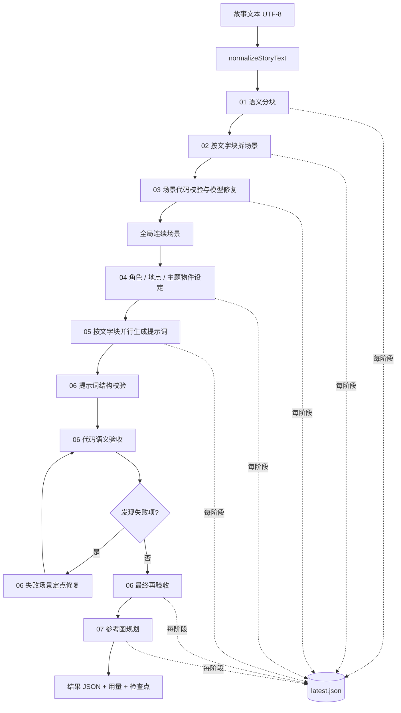

# 人生叙事通用流水线开发者指南

> 面向 `life-narrative-general-purpose-pipeline.js` 的开发、调试与集成说明。

## 一句话概述

`life-narrative-general-purpose-pipeline.js` 是一个 Node.js 编排器：它把一篇中文人生叙事文本依次转换为语义块、连续场景、角色/地点/主题物件设定、分镜提示词和参考图规划，并在每个关键阶段执行确定性校验、失败修复与检查点保存。

源码入口：[`life-narrative-general-purpose-pipeline.js`](./life-narrative-general-purpose-pipeline.js)

## 背景与解决的问题

直接让模型把长篇人生故事改写成图片提示词，通常会出现以下问题：

- 原文漏句、改写或顺序漂移；
- 场景过长、过短，或把两个独立事件塞进同一画面；
- 同一个人物跨场景换脸、换服装，地点结构不连续；
- 提示词缺少角色人数、镜头、道具、灯光或比例；
- 模型报告“通过”，但实际缺场景编号、参考图违规或语义不对应；
- 长任务中途失败后只能从头重跑，重复消耗模型调用和费用。

本模块采用“模型生成 + 代码校验 + 定点修复 + 检查点恢复”的方式处理这些问题。模型负责语义理解和视觉表达；代码负责原文完整性、编号、字段、阶段锁定、引用关系、语言和比例等可确定规则。

## 整体架构

源码中的 `STAGES` 是实际调度表。工作台可以把它展示为六个用户阶段，但实现内部还包含细分校验步骤，以及当前代码中的 `07-reference-plans` 参考图规划阶段。



### 调度表

| 实现阶段 | 主要职责 | 执行方式 |
| --- | --- | --- |
| `01-semantic-blocks` | 把原文划分为 7–10 个完整语义块 | 单次主流程，失败可重试 |
| `02-scene-split` | 把每个语义块拆成连续场景 | 按语义块并行；部分输入可由代码直接拆分 |
| `03-scene-validate-first` | 检查场景长度、覆盖、顺序和时间风险 | 按语义块并行，先代码修复，必要时调用模型 |
| `03-scene-validate-final` | 对首轮仍失败的语义块做最终定点修复 | 仅失败块并行 |
| `04-character-bible` | 生成人物阶段设定和主角参考图规划基础 | 与地点、主题物件设定并行 |
| `04-location-bible` | 生成地点设定 | 与角色、主题物件设定并行 |
| `04-theme-object-bible` | 生成主题物件设定 | 与角色、地点设定并行 |
| `05-prompts-generate` | 为各文字块生成场景提示词和本块连续性计划 | 按语义块并行 |
| `06-prompts-structure-repair` | 修复缺号、重复、字段缺失等硬问题 | 代码点名后单次结构修复 |
| `06-prompts-pre-semantic-code-check` | 生成语义修复前的代码报告 | 纯代码 |
| `06-prompts-code-acceptance` | 对所有提示词做结构、语义、阶段、语言、比例等校验 | 纯代码 |
| `06-prompts-final-targeted-repair` | 按失败场景分组，每组最多 4 个场景进行修复 | 失败块并行，最多 2 轮 |
| `06-prompts-global-audit` | 对远距离连续性风险做全局巡检 | 当前由 `ENABLE_GLOBAL_PROMPT_AUDIT=false` 跳过 |
| `06-prompts-final-recheck` | 最终代码验收 | 纯代码；失败则停止 |
| `06-prompts-quality-sampling-audit` | 抽样评价提示词质量 | 当前由 `ENABLE_PROMPT_QUALITY_SAMPLING=false` 跳过 |
| `07-reference-plans` | 为每个场景规划参考图来源、锚点和继承规则 | 按语义块并行，失败可重试一次 |

## 核心逻辑

### 1. 原文先规范化，再建立稳定索引

`normalizeStoryText(text)` 清理输入的换行形式和外围空白，但不改变叙事正文。之后通过 `buildSceneUnits(blockText)` 建立原子句段，场景主要引用 `unitIds`，再由 `materializeUnitScenes()` 根据代码恢复正文。

这意味着模型返回的“场景文字”不是最终可信来源。最终场景正文应以代码依据原子句段恢复的内容为准。

### 2. 代码校验优先于模型自报

`validateStructuredResult(result, schema)` 只检查顶层 JSON 对象和 `required` 字段；它不是完整业务验收。阶段级结果必须继续经过以下校验器：

- `inspectSemanticBlocks()`：数量、顺序、原文覆盖、地点与事件边界；
- `inspectBlockScenes()` / `inspectScenes()`：场景编号、连续性、长度和全文覆盖；
- `inspectStageFourBibles()`：人物、地点、主题物件设定与场景的对应关系；
- `inspectPromptHardStructure()`：提示词编号、缺项、重复和结构字段；
- `inspectPrompts()`：提示词语义、阶段、引用、人物数量、中文和 `比例：16:9`；
- `inspectReferencePlans()`：参考图来源、锚点和引用关系。

### 3. 只修复失败项

阶段 06 不会把整个提示词集合重新交给模型重写。代码先找出失败场景，再按文字块和失败编号分组，每次最多携带 4 个失败场景。模型返回的 `fixes` 通过 `mergePrompts()` 合并，合并后再次执行 `inspectPrompts()`。

### 4. 检查点恢复

`createRuntimeState(storyText)` 创建可序列化运行状态；`writeRuntimeCheckpoint()` 在阶段结束或失败时写入：

- `${checkpointDir}/${stage}.json`；
- `${checkpointDir}/latest.json`；
- 阶段归档目录中的 `normalized-result.json`、`input.json`、`code-validation.json`、`run-meta.json`、`usage.json` 和 `checkpoints/latest.json`；
- `agent-prompts` 下的提示词、Schema、结果和原始 HTTP 返回。

`loadRuntimeCheckpoint(checkpointDir)` 读取状态，`hasCompletedStage()` 判断是否可以跳过已完成阶段，`requireResumeField()` 防止检查点缺少后续必需字段时继续运行。

## 核心接口说明

### `runFromSemanticBlocks(options)`

主编排接口，适合被测试工具、工作台后端或其他 Node.js 程序调用。

```js
const {
  runFromSemanticBlocks,
  createDeepSeekApiAgentAdapter,
} = require('./life-narrative-general-purpose-pipeline')

const agentAdapter = createDeepSeekApiAgentAdapter({
  model: 'deepseek-v4-flash',
  concurrency: 5,
  promptLogDir: './run-checkpoints/agent-prompts',
})

const state = await runFromSemanticBlocks({
  storyText: story,
  agentAdapter,
  checkpointDir: './run-checkpoints',
})
```

参数：

| 参数 | 类型 | 说明 |
| --- | --- | --- |
| `storyText` | `string` | 中文人生叙事原文；会先经过 `normalizeStoryText()` |
| `agentAdapter` | `function` | 接收 `{ stage, label, prompt, schema, agentMode }`，返回 Promise(JSON 对象) |
| `checkpointDir` | `string` | 检查点根目录；空字符串表示不写入检查点 |
| `initialState` | `object \| null` | 可选的已加载运行状态，用于恢复 |

返回值是运行状态对象，常用字段包括：

```js
{
  completed: true,
  promptValidationPassed: true,
  storyText: '...',
  semanticBlocks: { items: [], report: {} },
  sceneBlocks: [],
  globalScenes: [],
  characterBible: {},
  locationBible: {},
  themeObjectBible: {},
  promptBlocks: [],
  prompts: [],
  referencePlans: [],
  reports: []
}
```

失败时返回 `completed: false` 和 `stoppedAt`，同时写入失败检查点；不会把未通过的结果伪装为成功。

### `createDeepSeekApiAgentAdapter(options)`

创建默认的 DeepSeek 结构化输出适配器。适配器使用 `fetch()` 调用 `${baseUrl}/chat/completions`，要求模型返回 JSON 对象。

主要参数：

| 参数 | 默认值 | 说明 |
| --- | --- | --- |
| `model` | `deepseek-v4-flash` | DeepSeek 模型名 |
| `baseUrl` | `https://api.deepseek.com` | API 基础地址 |
| `concurrency` | `10` | 并发任务上限 |
| `timeoutMs` | 20 分钟 | 单次请求超时 |
| `apiMaxRetries` | `2` | HTTP 超时、429、5xx 等可重试错误的重试次数 |
| `structuredMaxAttempts` | `3` | 同一轮结构化输出重试次数 |
| `agentRounds` | `2` | 结构化重试轮数 |
| `maxTokens` | `20000` | 请求的最大输出 Token |
| `promptLogDir` | `''` | 保存提示词、结果和原始 HTTP 返回的目录 |
| `env` | `process.env` | 用于注入 `DEEPSEEK_API_KEY` 等配置，便于测试 |

每次请求会：

1. 拼接系统提示词、业务提示词和 Schema；
2. 在调用前检查完整请求是否超过 40,000 Unicode 字符；
3. 请求 `response_format: { type: 'json_object' }`；
4. 解析模型返回并校验 required 字段；
5. 按配置写入 `.prompt.txt`、`.schema.json`、`.result.json` 和 `.http-*.raw.json`；
6. 对可恢复错误执行退避重试。

### 检查点接口

```js
const {
  loadRuntimeCheckpoint,
  writeRuntimeCheckpoint,
} = require('./life-narrative-general-purpose-pipeline')

const state = loadRuntimeCheckpoint('./run-checkpoints')
writeRuntimeCheckpoint(state, './run-checkpoints', 'manual-inspection')
```

注意：恢复前必须确认检查点对应同一份原文、同一版本代码和同一运行目录。不要把旧案例的检查点与新输入混用。

### 导出的校验器与构建器

模块通过 `module.exports` 暴露三组工具：

- `schemas`：各阶段结构化输出 Schema；
- `validators`：原文、场景、Bible、提示词和参考图校验器；
- `builders`：生成各阶段模型提示词的函数；
- `helpers`：规范化、合并、索引、检查点和用量相关辅助函数；
- `STAGES`、`TARGET_VERSION`、`AGENT_MODE`：运行元数据。

适合测试的最小接口示例：

```js
const { validators, helpers } = require('./life-narrative-general-purpose-pipeline')

const text = helpers.normalizeStoryText(input)
const units = helpers.buildSceneUnits(text)
const report = validators.inspectTextIntegrity(text, text)

console.log(units.length, report.passed)
```

## 快速开始

### 环境要求

- Node.js 18 或更高版本（代码使用全局 `fetch` 和 `AbortController` 等现代运行环境能力）；
- DeepSeek API Key；
- UTF-8 编码的纯文本故事文件。

本文件没有必需的第三方 npm 依赖；默认适配器直接调用 DeepSeek HTTP API。

### 配置密钥

在脚本同目录创建 `.env`，不要提交到 Git：

```dotenv
DEEPSEEK_API_KEY=你的密钥
DEEPSEEK_MODEL=deepseek-v4-flash
# 可选：DEEPSEEK_BASE_URL=https://api.deepseek.com
```

### 先做无费用预览

```powershell
node life-narrative-general-purpose-pipeline.js .\story.txt --foreground --dry-run
```

`--dry-run` 只读取输入、展示运行参数和第一条语义分块提示词，不调用模型、不产生费用。

### 前台运行一篇故事

```powershell
node life-narrative-general-purpose-pipeline.js `
  .\story.txt `
  --foreground `
  --out .\运行结果\case-001.json `
  --checkpoint-dir .\运行结果\case-001.checkpoints `
  --concurrency 5
```

主要输出：

- `case-001.json`：最终运行状态和结果；
- `case-001.checkpoints\latest.json`：最近检查点；
- `case-001.checkpoints\agent-prompts\`：模型请求、返回和原始 HTTP 响应；
- `case-001.quality-sampling-report.json`：启用质量抽检时生成；
- 运行目录下的 `usage.json`：请求数、Token、缓存和估算费用。

### 隐藏后台运行

CLI 默认后台运行。也可以显式指定：

```powershell
node life-narrative-general-purpose-pipeline.js .\story.txt `
  --background `
  --out .\运行结果\case-001.json `
  --checkpoint-dir .\运行结果\case-001.checkpoints
```

后台模式会立即返回，实际前台子进程会写入 `.log`、`.err.log`、结果文件和检查点。判断是否完成时，应查看子进程命令行、结果文件和 `checkpoints\latest.json`，不要只相信父进程 PID。

### 从检查点恢复

```powershell
node life-narrative-general-purpose-pipeline.js .\story.txt `
  --foreground `
  --resume `
  --out .\运行结果\case-001.json `
  --checkpoint-dir .\运行结果\case-001.checkpoints
```

恢复会复用已完成阶段，缺少必需字段时直接报错。若输入文本或流水线版本已改变，应创建新运行目录，不要强行 `--resume`。

## CLI 参数速查

| 参数 | 作用 |
| --- | --- |
| `<story-file>` | 必填，故事文本路径 |
| `--out <file>` | 最终 JSON 输出路径 |
| `--checkpoint-dir <dir>` | 检查点、阶段归档和提示词日志目录 |
| `--no-checkpoints` | 关闭检查点，不建议用于正式长任务 |
| `--foreground` | 当前窗口运行 |
| `--background` | 隐藏后台运行，默认模式 |
| `--background-visible` | 可见后台窗口运行 |
| `--provider deepseek` | 当前唯一支持的 Provider |
| `--model <name>` | 覆盖 DeepSeek 模型 |
| `--concurrency <n>` | 控制并发；会影响 API 压力和速度 |
| `--api-timeout-ms <n>` | 单次 API 请求超时 |
| `--api-max-retries <n>` | HTTP 层重试次数 |
| `--structured-attempts <n>` | 结构化输出重试次数 |
| `--agent-rounds <n>` | 结构化重试轮数 |
| `--max-tokens <n>` | 模型最大输出 Token |
| `--print-prompts` | 在终端打印完整提示词，注意可能泄露原文 |
| `--print-agent-results` | 在终端打印完整模型结果 |
| `--dry-run` | 只预览，不调用模型 |
| `--adapter-test` | 执行一次极小的适配器连通性测试 |
| `--generate-images` | 文本流水线结束后调用旁路生图脚本 |
| `--image-model` | 生图模型，默认 `gpt-image-2` |
| `--image-size` | 场景图比例，默认 `16:9` |
| `--image-character-size` | 角色参考图比例，默认 `16:9` |
| `--image-concurrency` | 生图并发数 |
| `--image-retries` | 生图失败重试次数 |

## 数据与副作用

### 输入

- UTF-8 故事文本；
- `.env` 或当前 Shell 中的 `DEEPSEEK_API_KEY`；
- 可选的旧检查点目录。

### 输出

最终状态中最重要的业务字段是：

| 字段 | 内容 |
| --- | --- |
| `semanticBlocks` | 语义块及其校验报告 |
| `sceneBlocks` | 按文字块分组的场景 |
| `globalScenes` | 连续全局场景，具有稳定 `index` |
| `characterBible` | 人物阶段设定与主角参考图信息 |
| `locationBible` | 地点设定 |
| `themeObjectBible` | 主题物件设定 |
| `promptBlocks` | 每个文字块的 `continuityDecision` 与 `localAnchor` |
| `prompts` | 场景级绘图提示词 |
| `referencePlans` | 每个场景的参考图来源与继承规划 |
| `reports` | 各阶段代码验收和模型修复报告 |
| `usage` / `usage.json` | 请求、Token、缓存、模型和估算费用 |

### 文件副作用

运行会创建目录和文件，尤其是开启 `checkpointDir` 时。原始 HTTP 返回可能包含完整提示词和模型输出；这些文件不能提交到 Git，也不能公开发布。密钥只从环境或 `.env` 读取，日志中只输出 `[set]`，不应把真实密钥写入提示词、结果或错误日志。

## 注意事项

### 正确性

1. `completed: true` 和顶层 `promptValidationPassed` 不是唯一质量依据。开发者还应检查阶段报告中的 `coveragePassed`、`referencePassed`、`semanticPassed`、`stagePassed`、`promptLanguagePassed` 和 `promptAspectRatioPassed`。
2. 阶段 05 的提示词必须覆盖所有 `expectedPromptIndices`，缺号时不能直接进入阶段 06。
3. `validateStructuredResult()` 只做浅层 required 字段检查；真正的业务约束由阶段校验器承担。
4. 抽象心理句不能被擅自具体化为原文没有的卧室、天台、屋顶、城市天际线等地点或事件。
5. 参考图的 `anchorEligible`、`sceneIndex` 和 `referenceRole` 是连续性关键字段，修改提示词时必须保留其语义关系。

### 性能与费用

- 阶段 02、03、04、05、07 有并行机会；`concurrency` 越高，速度可能越快，但也更容易触发服务端限流。
- DeepSeek 完整请求超过 40,000 Unicode 字符会在发请求前阻断；应压缩上下文或减少失败修复批次，不能绕过限制。
- `structuredMaxAttempts`、`agentRounds` 和 `apiMaxRetries` 会叠加失败成本。调试时建议先使用 `--dry-run`、较低并发和小输入。
- 代码会根据阶段归档中的原始 HTTP JSON 汇总 Token、缓存和估算费用；费用是按代码内记录的 DeepSeek 定价快照计算的，不等于账单最终值。

### 异常与恢复

- 可重试 HTTP 状态包括 `429`、`500`、`502`、`503`、`504` 以及超时。
- JSON 解析失败、结构字段缺失或阶段代码验收失败会进入结构化重试或停止流程。
- 后台模式下，父进程立即返回是正常行为；应检查真实子进程、日志、结果和检查点。
- 不要覆盖已有运行目录。每次正式运行使用唯一目录，便于复盘、对比和恢复。

### 兼容性

- 当前 Provider 只接受 `deepseek`；传入其他 Provider 会直接报错。
- 模块使用 CommonJS：`require()` 和 `module.exports`。
- 代码依赖现代 Node.js 的全局 `fetch`、`AbortController`、`Promise.all` 等能力。
- `--generate-images` 依赖同目录的 `life-narrative-maizi-images.js`；该脚本不存在时会在文本流水线完成后报错。

## 维护与扩展建议

### 添加新阶段

1. 先在 `STAGES` 中声明稳定的阶段 ID、名称、Schema 和并行策略；
2. 在 `createRuntimeState()` 增加状态字段；
3. 在 `runFromSemanticBlocks()` 中实现执行、校验、失败停止和检查点；
4. 为恢复逻辑增加 `hasCompletedStage()` / `requireResumeField()` 的依赖字段；
5. 将新 Schema、Builder、Validator 和 Helper 加入 `module.exports`；
6. 同步阶段测试工具和运行目录格式；
7. 用固定输入、回归案例和 `--dry-run` 验证后再进行真实模型调用。

### 修改公共 Schema 或校验器

这类修改会影响多个阶段和已有检查点，应运行受影响阶段的完整案例集，并比较质量、Token、耗时和费用。不能只因为命令退出码为 0 就更新稳定基线。

### 基础验证命令

```powershell
node --check life-narrative-general-purpose-pipeline.js
node --test tests\deepseek-stage-adapter.test.js tests\stage-test-cli.test.js
git diff --check
```

不涉及模型调用的修改，优先使用语法检查、固定输入和测试适配器；未经确认不要运行付费模型。

## 版本与维护信息

- `TARGET_VERSION`：`2.1`
- `AGENT_MODE`：`general-purpose`
- 默认 Provider：`deepseek`
- 默认模型：`deepseek-v4-flash`
- 默认并发：`10`
- 单次请求字符上限：`40,000` Unicode 字符
- 当前全局提示词巡检：关闭（`ENABLE_GLOBAL_PROMPT_AUDIT=false`）
- 当前提示词质量抽检：关闭（`ENABLE_PROMPT_QUALITY_SAMPLING=false`）

维护本文件时，应以源码的 `STAGES`、`parseCliArgs()`、`module.exports` 和实际测试工具为准；如果 CLI、输出目录或 Schema 发生变化，应同步更新本指南。


